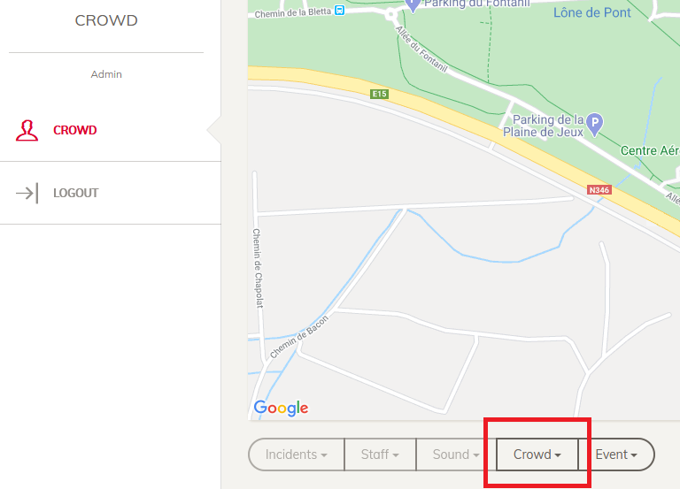
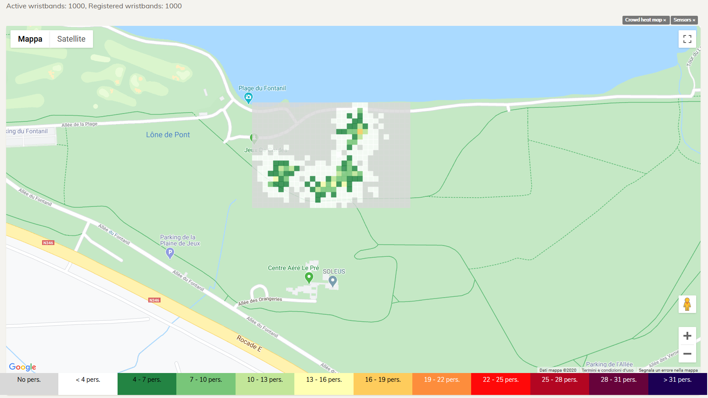
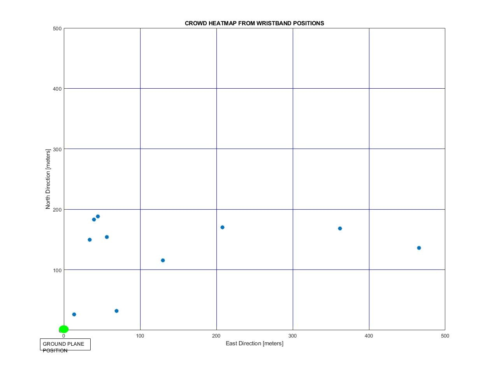

# Docker Compose Complete MONICA Toolchain Example 

## Overview

This repository reports a self-consistent docker compose demonstration of whole MONICA toolchain, from data simulation to visualization. Main components are the following:

- [MQTT Wristband GW Emulator](https://github.com/MONICA-Project/WristbandGwMqttEmulator)
- [SCRAL](https://github.com/MONICA-Project/scral-framework) - MQTT Wristbands Module
- [GOST](https://github.com/gost/server)
- MQTT Broker ([Eclipse Mosquitto](https://mosquitto.org/))
- Service Catalog
- [High Level Data Fusion](https://github.com/MONICA-Project/HLDFAD_SourceCode)
- Common Operational Picture (COP)

In particular, such example generates Crowd Heatmap calculated from Wristband locations within Woodstower geographic area (Ground Plane Position: Latitude: 45.7968451744, Longitude: 4.95029322898, 300 m x 200 m rectangle area, cell size 10 m x 10 m), 
i.e. the computation of occurrency of localization within geospatial density map on the surface, with rows increasing with respect to the North and columns increasing with respect to East direction. 

The output is shown on a web map available locally.

## Disclaimer

This package shall be intended as a demonstrative software suite just to allow to concretely visualize and understand MONICA solution. 

Such solution has been tested with success on limited number of devices (less than 10); therefore, it is not possible to guarantee 100% successful execution of solution on all kind of PC.

## Repository Contents

In the following it is reported a quick overview of the current repository in terms of folder presentation.

|Folder|Content|Link|
| ---- | -------------------------------- | ---- |
|.| Current Folder. It contains Docker Composes and environment files (*NOTE*: It is not completed before startup, see Section [started]({#getting-started})|[${REPO_ROOT}](.)|
|environment| It contains files supporting tools for beginning setup project| [${REPO_ROOT}/environment](environment)|
|volumes| Persistent Volumes for Docker containers launched (e.g. logs)| [${REPO_ROOT}/volumes](volumes)| 
|tools| Bash script to startup environment for first usage| [${REPO_ROOT}/tools](tools)|
|resources| Resource files for README and documentation|[${REPO_ROOT}/resources](resources) |

## Quick Start Guide

## Resources Requirements

In [Docker Statistics](resources/DockerStatistics.json), it is possible to check the disk occupation for each image. The total size of images on disk is around 13 GB.

Solution has been tested with success on machine Ubuntu, CentOS and Windows 10 with at least 8 GB RAM.

### Getting Started
<!-- Instruction to make the project up and running. -->
#### Machine Setup

First of all, ensuring that Docker Engine and git are correctly installed on machine. 

In Windows, Docker and Docker compose are included in [Docker Desktop](https://docs.docker.com/docker-for-windows/install/), whereas in Linux, it is necessary to install them separately, [Docker](https://docs.docker.com/install/linux/docker-ce/ubuntu/) and [Docker Compose](https://docs.docker.com/compose/install/). **NOTE**: Minimum Docker Compose version compliant with this solution (Version: 3.7) is 1.25.4. Check version with command:

```bash
$ docker-compose --version
```

#### Startup Environment

After clone current git, from bash shell go to ${REPO_ROOT}/tools folder and launch command (Linux Bash):

```bash
${REPO_ROOT}/tools:$ bash configure_docker_environment.sh local
```

or under Windows Command Prompt:

```console
%REPO_ROOT%/tools> configure_docker_environment.bat local
```

To launch development environment (under construction) configuration, launch:
```bash
${REPO_ROOT}/tools:$ bash configure_docker_environment.sh dev
```

or under Windows Command Prompt:

```console
%REPO_ROOT%/tools> configure_docker_environment.bat dev
```

**NOTE(1)**: The environment consistent for such version of repository is local; dev is set just as an example for future extension of this repository.

**NOTE(2)**: Sometimes could happen mistakes due to line termination difference Unix-Windows (when launching script under Unix environment or from git bash in Linux). Therefore, in case of trouble, before destroying your PC, just launch:

```bash
${REPO_ROOT}/tools:$ dos2unix configure_docker_environment.sh
${REPO_ROOT}/tools:$ dos2unix repo_paths.sh
${REPO_ROOT}/tools:$ dos2unix purge.sh
```

#### Check Environment

In order to check that the environment is configured correctly, from ${REPO_ROOT} launch command:

```bash
${REPO_ROOT}:$ docker-compose config
```

The output should be similar to the content of file [DockerConfig](resources/dockercompose_config.local).

### Run Docker Compose Solution

After first configuration reported in Section [Startup]({#getting-started}), it is necessary to download all the images. Before start, optionally it is possible to launch from ${REPO_ROOT}:

```bash
${REPO_ROOT}:$ docker-compose up --no-start
```

Then, for running simulation launch command from ${REPO_ROOT}:

```bash
${REPO_ROOT}:$ docker-compose up -d
```

**NOTE(1)**: The second command can also download images and launch running. The first is an additional check before effectively launch simulation.

**NOTE(2)**: In Linux environment it should be necessary to execute docker-compose command with administrator permissions. Therefore it should be necessary to add sudo before launching commands.

### Check Execution

#### COP UI Web Portal (Map)

On [COPUI localhost:8900/crowd](http://127.0.0.1:8900/crowd) there is the COP User Interface that runs and shows the evolution of crowd heatmap with refresh overlapped on geographic map (username: admin@monica-cop.com, password: CROWD2019!).
Then, go on the bottom of map and select Crowd Heatmap as indicated in the following screenshot. Note that the first output could take some minutes before appearing. 



The output should be similar to the following picture.



#### Real Time Check

The solution includes an instance of portainer, that should run on localhost:9000. Have a look on containers to check if they are correctly running or not. Then, it is possible to check with a client MQTT (e.g. [MQTT.fx](https://mqttfx.jensd.de/)), 
connecting on MQTT Broker on localhost:1883, subscribing to topic: ${V_APPSETTING_GOST_NAME}/Datastreams(13151)/Observations. 
In the following, the default configuration to retrieve output: 
- **Crowd Heatmap Output Topic**: GOST/Datastreams(13151)/Observations
- **MQTT URL**: 127.0.0.1:1883

### Stop Docker Compose Solution

To stop simulation, launch command from ${REPO_ROOT}:

```bash
${REPO_ROOT}:$ docker-compose down
```

### Clean up Resources after shutdown

If the historical informationm of previous running are not interested, on folder [tools](tools) it has been added purge script to clean up folder after usage and shutdown. 

From bash shell, launch:

```bash
${REPO_ROOT}/tools:$ bash purge.sh
```

**NOTE**: such script performs pruning of unused docker resources and it is useful to prevent big size occupation on disk after very long usage (more than 20 hours).

## Environment Variable

Detailed documentation about environment variable is available in repositories and dockerhubs readme (check Section [Repository and Dockerhub](#source-code-repository-and-dockerhub-images)). 

In the following are reported quick useful variables reported in .env file generated after startup procedure. It allows to modify the behaviour of the simulation. Handle with care!

| Environment Variable | Meaning | Default Value | Note|
| --------------- | --------------- | --------------- |--------------- |
|V_COUNT_WRISTBANDS|Number of Emulated Wristband|1200| Avoid to set number greater than 1500 |
|V_BURST_INTERVAL_SECS|Interval sending burst interval| 25| Avoid to set number lower than 15|

**NOTE**: This solution has been tested with success with default values reported in the table. It has to be remarked that bigger variation of such numbers has not been validated and can compromise the execution of demonstration and increase computational resources required by demo.

## Crowd Heatmap Output explaination

A simple example is shown in figure below. The points represents the location of each person with respect to the Ground Plane Position. 



Considering the ground plane position incognite and geographic area of 500 m x 500 m with cells 100 m x 100 m, the generated density map is:

|  | 0 | 1 | 2 | 3 | 4 |
| :---- | ---- | ---- | ---- | ---- | ---- |
| **4**| 0 | 0 | 0 | 0 | 0 |
| **3**| 0 | 0 | 0 | 0 | 0 |
| **2**| 0 | 0 | 0 | 0 | 0 |
| **1**| 4 | 1 | 1 | 1 | 1 |
| **0**| 2 | 0 | 0 | 0 | 0 |

Where Cell(0,0) is the Ground Plane Position. In this case, it means that in Cell (Row=0, Col=1) there are 4 people in a space of 100 m x 100 m, 100 m North and 0 m East with respect to Ground Plane Position.

## Docker Compose Contents

The following table shows the list of services and minimum explaination as they appears on docker-compose.yml and docker-compose.override.yml:

| Service Name | Container Name | Short Description | Links | Depends on |
| --------------- | --------------- | --------------- | --------------- | --------------- |
| hldfad_worker| hldf_docker_celery_worker_${ENVTYPE} | High Level Data Fusion and Anomaly Detection Core | rabbit, redis, mqttbroker, dashboard, worker_db, servicecatalog | rabbit, redis, mqttbroker, dashboard, scral, wb_mqtt_emulator, servicecatalog|
| rabbit | hldf_docker_rabbit_${ENVTYPE} | Rabbit For Queue Management (support for hldfad_worker celery tasks) | None | None |
| redis | hldf_docker_cache_redis_${ENVTYPE} | Temporarily cache for hldfad_worker | None| None |
| node-red | gost-node-red_${ENVTYPE} |  | None| None |
| mqttbroker | gost-mqttbroker-${ENVTYPE} | Broker MQTT as a middleware for SCRAL and hldfad_worker | None | None |
| gost-db | gost-db_${ENVTYPE} | DB for GOST | None | None |
| gost | gost-gostreal_${ENVTYPE} | Real GOST Engine | None | mqttbroker, gost-db |
| dashboard | gost_dashboard_${ENVTYPE} | Web services to get GOST Catalog with Things and Datastreams | None | gost |
| scral | SCRAL-wb-MQTT_${ENVTYPE} | SCRAL protocol adapter-middleware | None | dashboard, gost, mqttbroker |
| copdb | copdb_docker_${ENVTYPE} | COP DB | None | None |
| copapi | copapi_docker_${ENVTYPE} | *Missing* | None | mqttbroker, gost, copdb |
| copui | copapi_docker_${ENVTYPE} | COP User Interface (Map View) | None | mqttbroker, gost, copdb,copapi |
| copupdater | copupdater_docker_${ENVTYPE} | *Missing* | None | copapi, gost, mqttbroker,copdb |
| servicecatalog | wp6_servicecatalogemul_docker_${ENVTYPE} | WP6 Service Catalog (temporarily) | worker_emul_db | worker_emul_db |
| worker_db | hldf_host_workerdb_${ENVTYPE} | PosgreSQL Database used by hldfad_worker to store output | None | None |
| portainer | hldf_docker_portainer | ${PORTAINER_DOCKER_EXPOS_PORT} | 9000 | None |
| worker_emul_db | hldf_host_workeremul_db_${ENVTYPE} | PosgreSQL Database to support servicecatalog  | None | servicecatalog |
| wb_mqtt_emulator | WB-MQTT-Emulator | Wristband Observations Generator Emulator | mqttbroker | dashboard,gost,mqttbroker,scral |

**NOTE**: *worker_emul_db* is used only from servicecatalog, which is a temporarily replacement of the official one (WP6 GOST Service Catalog)

## Source Code Repository and DockerHub Images

The followind table provides link for Docker Hub images and Git Hub Source Code repository. They include documentation about such services. Please, refers to them for detailed information not reported hereafter.

| Service Name | DockerHub Image | GitHub SourceCode |
| --------------- | --------------- | --------------- |
| hldfad_worker| [monicaproject/hldfad_worker](https://hub.docker.com/repository/docker/monicaproject/hldfad_worker) | [HLDFAD Open Source Repository](https://github.com/MONICA-Project/HLDFAD_SourceCode)  |
| scral | [monicaproject/scral](https://hub.docker.com/repository/docker/monicaproject/scral) | [SCRAL Open Source Repository](https://github.com/MONICA-Project/scral-framework)|
| servicecatalog | [monicaproject/servicecatalogemulator](https://hub.docker.com/repository/docker/monicaproject/servicecatalogemulator) | [Service Catalog Open Source Repository](https://github.com/MONICA-Project/GostScralMqttEmulator)|
| wb_mqtt_emulator | [monicaproject/wb_mqtt_emulator](https://hub.docker.com/repository/docker/monicaproject/wb_mqtt_emulator) | [Wristband Gateway MQTT Emulator Open Source Repository](https://github.com/MONICA-Project/WristbandGwMqttEmulator) |
| copdb | [monicaproject/example-databases](https://hub.docker.com/repository/docker/monicaproject/example-databases) | *Missing* |
| copapi | [monicaproject/copapi](https://hub.docker.com/repository/docker/monicaproject/copapi) | [GitHub COPAPI Repository](https://github.com/MONICA-Project/COP.API) |
| copupdater | [monicaproject/copupdater](https://hub.docker.com/repository/docker/monicaproject/copupdater)  | [GitHub COPUI Repository](https://github.com/MONICA-Project/COPUpdater) |
| copui | [monicaproject/monica-cop-examples](https://hub.docker.com/repository/docker/monicaproject/monica-cop-examples) | [GitHub COPUI Repository](https://github.com/MONICA-Project/COP-UI) |

### TCP Server activated

The following table show the list of services with opened ports (inside subnet and forward to external connections):

| Service Name | Type Port | External Port | Internal Subnet Port | Income Connection From |
| --------------- | --------------- | --------------- | --------------- | --------------- |
| rabbit | Service | ${RABBITMQ_DOCKER_PORT_DIAGNOSTIC} | 5672| hldfad_worker |
| rabbit | Diagnostic | ${RABBITMQ_DOCKER_PORT_SERVICE} | 15672| None |
| redis | Service | ${REDISCACHE_PORT} | 6379| hldfad_worker |
| node-red | Service | 1880 | 1880| gost |
| mqttbroker | Service | 1883 | 1883| gost, scral, hldfad_worker|
| mqttbroker | Diagnostic | 9001 | 9001| None |
| dashboard | Service | 8080 | 8080| gost, hldfad_worker |
| scral | Service | 8000 | 8000| gost, hldfad_worker |
| servicecatalog | Service | ${WEB_GOST_PORT} | ${V_SERVER_WEB_PORT} | hldfad_worker |
| servicecatalog | Diagnostic | ${WEB_DIAGNOSTIC_PORT} | 3001 | hldfad_worker |
| worker_db | Service | ${PGSQL_WORKER_PORT} | ${PGSQL_WORKER_PORT} | hldfad_worker |
| portainer | Service | ${PORTAINER_DOCKER_EXPOS_PORT} | 9000 | None |
| copapi | Service | 8800 | 80 | copupdater |
| copui | Service | 8900 | 8080 | copapi |
| worker_emul_db | Diagnostic | ${PGSQL_EMUL_PORT} | ${PGSQL_EMUL_PORT} | servicecatalog |

**NOTE**:

- Variables ${} are those reported in .env file. Therefore, such port can be easiliy changed;
- worker_emul_db is used only from servicecatalog, which is a temporarily replacement of the official one (WP6 GOST Service Catalog)

## Contributing
Contributions are welcome. 

Please fork, make your changes, and submit a pull request. For major changes, please open an issue first and discuss it with the other authors.

## Affiliation
  
This work is supported by the European Commission through the [MONICA H2020 PROJECT](https://www.monica-project.eu) under grant agreement No 732350.
| copdb | Service | ${PORTAINER_DOCKER_EXPOS_PORT} | 9000 | None | 
